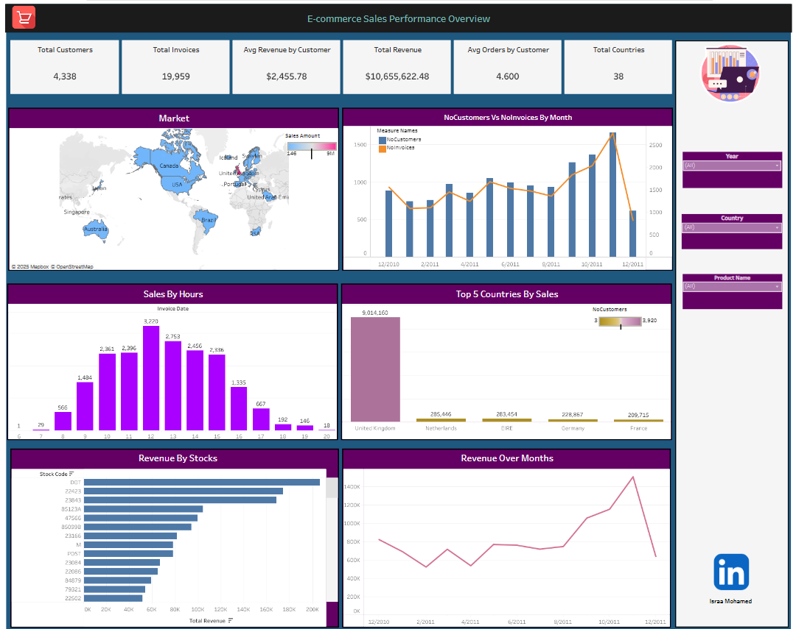

# Ecommerce Sales Dashboard (Tableau)

🔗 [View the live dashboard on Tableau Public](https://public.tableau.com/app/profile/israa.mohamed/viz/EcommerceDashboard_17246286852800/Dashboard1)

## About the Project

This is my very first attempt at building a data visualization dashboard using Tableau. The dataset was sourced from [Kaggle - Ecommerce Data](https://www.kaggle.com/datasets/carrie1/ecommerce-data), and the goal was to explore key ecommerce insights and visualize customer and sales behaviors.

While this was my initial try, the experience taught me a lot about interactive dashboards and common data issues, which helped me improve in future projects.

---

## Dashboard Highlights

✅ **KPIs and Summary**
- Total Customers
- Total Invoices
- Total Revenue
- Number of Countries
- Average Orders per Customer
- Average Revenue per Customer

📈 **Charts and Visuals**
1. Revenue Over Months (Line Chart)
2. Top 5 Countries by Revenue & Customer Count (Gradient Bar Chart)
3. Market Map (Geographical Sales Distribution)
4. Revenue by Stock with Number of Orders in Tooltip
5. Orders Frequency by Hour (Hourly Heatmap)
6. Customers vs Invoices Over Time (Line and Bar Combo)

---

## Tools & Technologies

- **Tableau Public** (Data Visualization)
- **Excel/CSV** (Dataset source)
- **Kaggle Dataset:** [Ecommerce Data](https://www.kaggle.com/datasets/carrie1/ecommerce-data)
